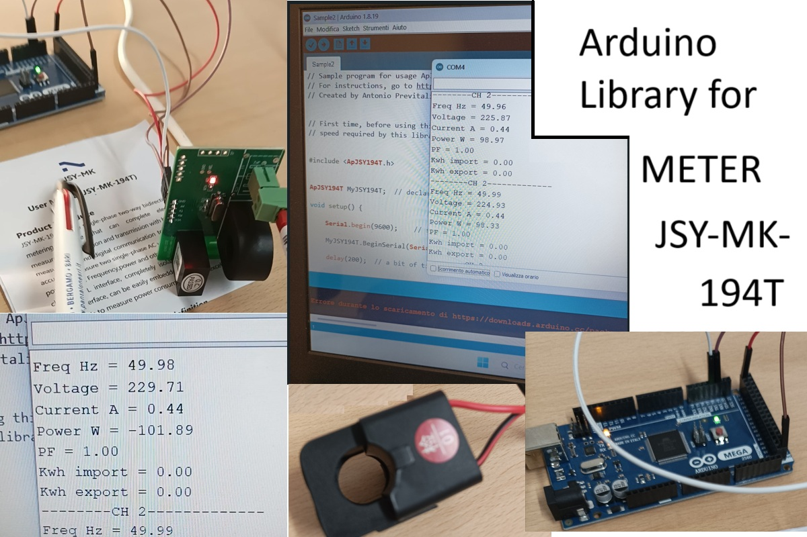

# ApJSY194T
Library for interfacing meter JSY-MK-194T with Arduino

A direct approach to the meter is used without the need to know the Modbus protocol



## Getting Started

very simple !

```c++

// NOTE First time, before using this code Sample2 see Sample1 to set the module to the 
// speed required by this library.

#include <ApJSY194T.h>


ApJSY194T MyJSY194T;  // declare object MyJSY194T

void setup() {
       
    Serial.begin(9600);    // serial monitor console at 9600 bps
    
    MyJSY194T.BeginSerial(Serial1);   // Set serial1 hardware of arduino mega 2560 at 19200 bps

    delay(200);  // a bit of time used by jsy-mk-194t serial to start (NOT REMOVE, or TEST)

}


void loop() {
 

    if ( MyJSY194T.okReadMeter() )
    {
     /* remove comment for view CH1
      Serial.println("--------CH 1-------------");
      Serial.print("Freq Hz = ");
      Serial.println(MyJSY194T.Frequenz);
      Serial.print("Voltage = ");
      Serial.println(MyJSY194T.Voltage1);      
      Serial.print("Current A = ");
      Serial.println(MyJSY194T.Current1);
      Serial.print("Power W = ");
      Serial.println(MyJSY194T.Power1);
      Serial.print("PF = ");
      Serial.println(MyJSY194T.PowFact1);     
      Serial.print("Kwh import = ");
      Serial.println(MyJSY194T.Import1);
      Serial.print("Kwh export = ");
      Serial.println(MyJSY194T.Export1);  
    */
      
      Serial.println("--------CH 2-------------");
      Serial.print("Freq Hz = ");
      Serial.println(MyJSY194T.Frequenz);
      Serial.print("Voltage = ");
      Serial.println(MyJSY194T.Voltage2);      
      Serial.print("Current A = ");
      Serial.println(MyJSY194T.Current2);
      Serial.print("Power W = ");
      Serial.println(MyJSY194T.Power2);
      Serial.print("PF = ");
      Serial.println(MyJSY194T.PowFact2);     
      Serial.print("Kwh import = ");
      Serial.println(MyJSY194T.Import2);
      Serial.print("Kwh export = ");
      Serial.println(MyJSY194T.Export2);      
    }
    else  Serial.println("Error reading meter");
      

    delay(1000);  // time for human reading
}
```
```
Output is:
--------CH 2-------------
Freq Hz = 49.98
Voltage = 227.78
Current A = 0.44
Power W = 100.64
PF = 1.00
Kwh import = 0.00
Kwh export = 0.00
-------------------------
```
## For further information see the doc folder


